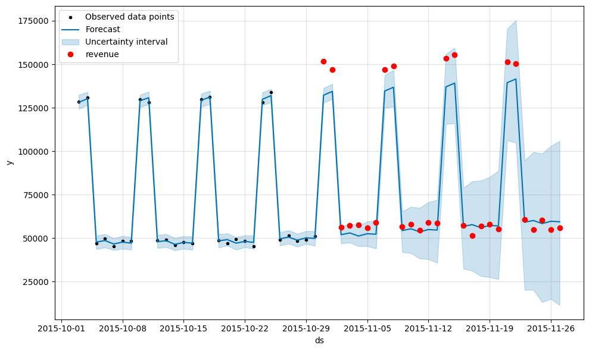
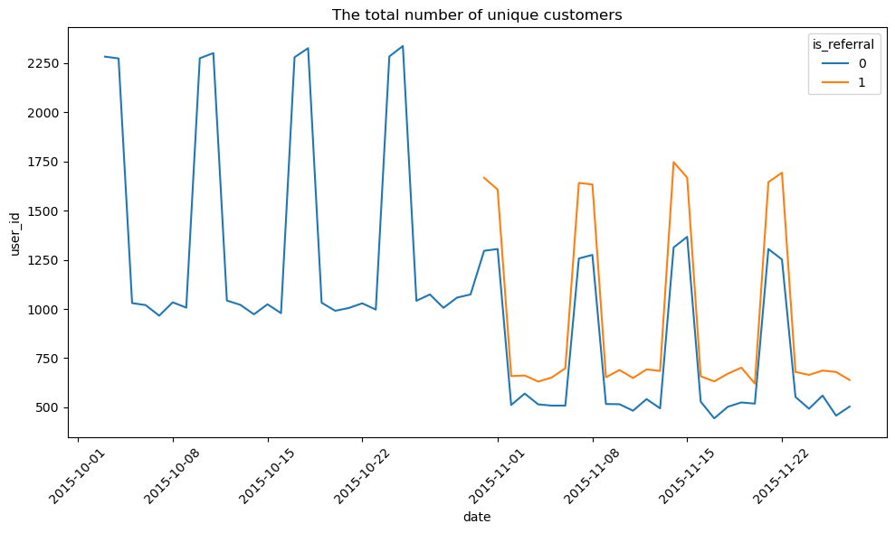
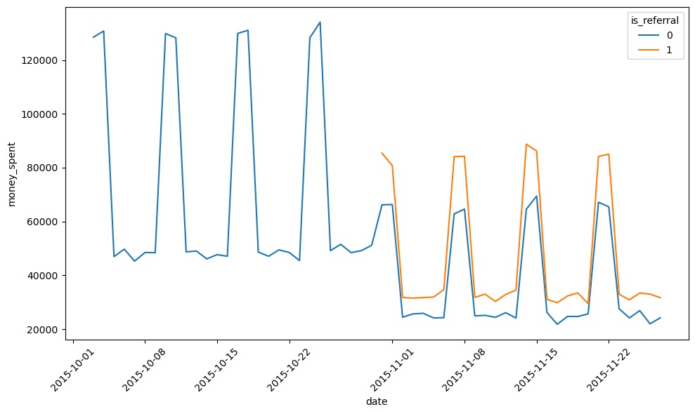
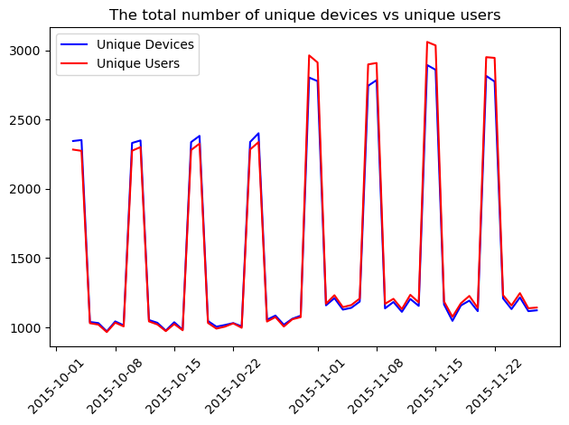
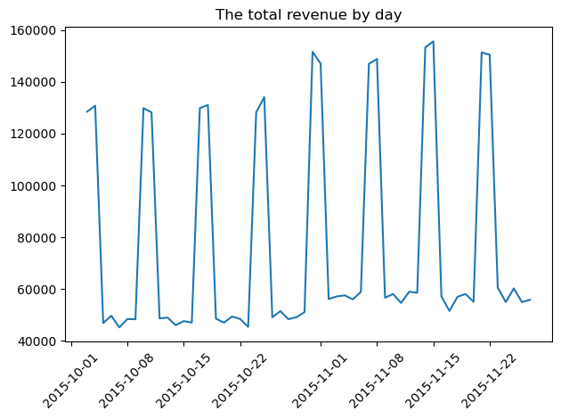
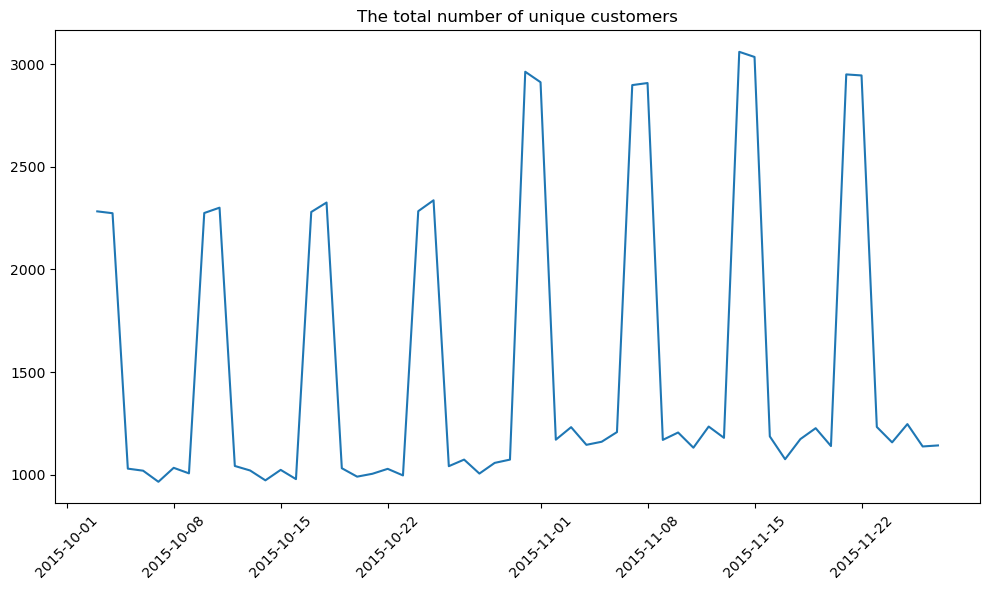

# Referral Program Impact Analysis
 
**Tools Used:** Python, Pandas, Prophet, Seaborn, Matplotlib, SciPy

---

## Table of Contents

- [Overview](#overview)
- [Real-World Use Cases](#real-world-use-cases)
- [Features](#features)
- [Installation](#installation)
- [Usage](#usage)
- [Visuals](#visuals)
- [Conclusion](#conclusion)
- [Contributing](#contributing)
- [License](#license)

---

## Overview

This project evaluated the impact of a referral program launched on October 31, 2015. Using time-series forecasting and exploratory analysis, it examined changes in user behavior, revenue trends, and signs of cannibalization or fraud post-launch.

---

## Real-World Use Cases

- **Product Teams** can evaluate whether referral incentives lead to sustainable growth or cannibalize organic users.
- **Fraud & Risk Analysts** can use device and account behavior patterns to identify suspicious user activity.
- **Marketing Analysts** can determine if revenue uplift is significant enough to justify incentive programs.
- **Data Scientists** can apply time-series forecasting and hypothesis testing to real-world business KPIs.

---

## Features

### 1. Data Validation & Cleanup
- Verified no referrals before launch; reassigned inconsistent referral flags per user.
- Ensured each user was consistently classified as referred or not based on first appearance.

### 2. Behavioral Insights
- **Users increased by ~22%** post-launch, but revenue only rose **~17%**.
- **Non-referred user count dropped**, indicating **channel cannibalization**.
- Suspicious spike in users per device, suggesting users created multiple accounts to exploit referral rewards.

### 3. Time-Series Forecasting with Prophet
- Trained Prophet model on pre-launch revenue to forecast expected post-launch revenue.
- Actual post-launch revenue consistently exceeded the upper 95% confidence interval.

- Average actual revenue: **$83,714/day**  
- Predicted baseline: **$79,049/day**

### 4. Statistical Significance
- Conducted **paired t-test** comparing forecast vs. actual revenue.
- Result: **p = 0.00242** → statistically significant uplift, though data irregularities caution against definitive conclusions.

---

## Installation

To install the required Python packages:

pip install -r requirements.txt

## Usage

To run the analysis:

python user_referral.py

## Visuals

Average actual revenue: $83,714/day

Forecasted baseline: $79,049/day

Statistical test result: p = 0.00242 → Significant uplift

- 
- 
- 
- 
- 
- 

## Conclusion

The referral program correlated with increased users and revenue, but evidence of fraud and cannibalization complicates interpretation. Recommends follow-up with engineering/product teams to clean referral logic and audit incentives.

---

## Contributing

We welcome community contributions!

1. Fork the repository

2. Create a new branch:

git checkout -b feature/your-feature

3. Make your changes

4. Push to your branch:

git push origin feature/your-feature

5. Submit a Pull Request

## License
This project is licensed under the MIT License.
 

